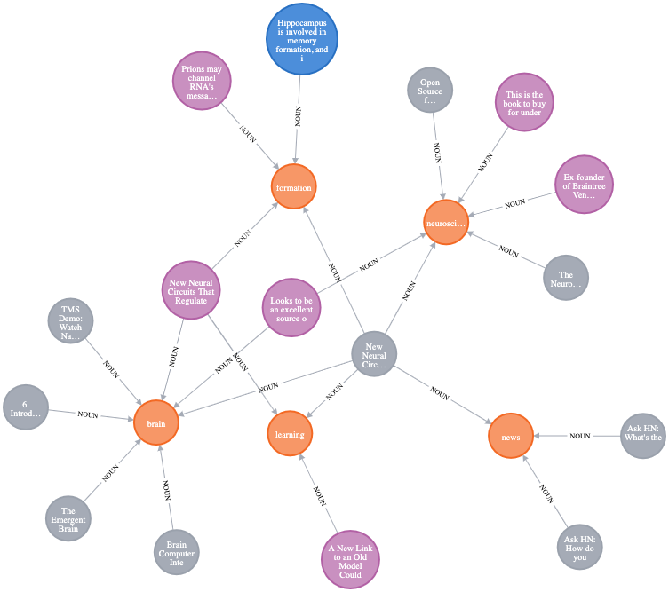

## This is a knowledge graph construction and consumption program written for personal use

I use the following pieces to fulfill it:
- [Sidebrain plugin](https://chrome.google.com/webstore/detail/sidebrain/mihpmbkcaoflflkphiejdclncabcmjbj) to act as an ingestion mechanism for content and thought
- I use a personal free instance of a [Neo4j](https://neo4j.com/) to construct and show the graph. 
- I use a CLI tool to navigate through the graph, identify how I want to slice the universe.
- [Spacy](https://spacy.io/) to do the natural langauge processing around tokenization and entity recognition. I add to the pipeline a couple of third party libraries such as tf-idf to test if the model gets better. It's still in there haven't removed it even though I am not using it. 

Few links that may help:
[A youtube demo and explanation of the backend of this codebase](https://youtu.be/JjIIGAORziM))

